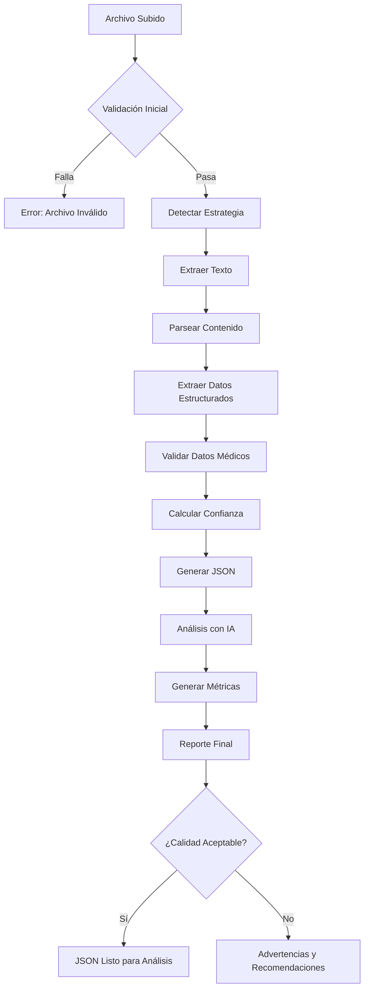

# 📊 ANÁLISIS COMPLETO DEL SISTEMA DE SUBIDA DE ARCHIVOS - EMG/DLM

## 🏗️ ARQUITECTURA ACTUAL DEL SISTEMA

### Componentes Principales

```
┌─────────────────────────────────────────────────────────────┐
│                    SISTEMA DE CONVERSIÓN                    │
├─────────────────────────────────────────────────────────────┤
│ 1. CARGA DE ARCHIVOS                                       │
│    ├── FileUpload.tsx (Componente básico)                  │
│    └── EnhancedFileUpload.tsx (Componente avanzado)        │
│                                                             │
│ 2. ESTRATEGIAS DE CONVERSIÓN                               │
│    ├── DocxConversionStrategy (Word)                       │
│    ├── PDFConversionStrategy (PDF)                         │
│    ├── RTFConversionStrategy (RTF)                         │
│    └── PlainTextConversionStrategy (TXT)                   │
│                                                             │
│ 3. PROCESAMIENTO DE DATOS                                  │
│    ├── PatientDataProcessor                                │
│    ├── NCSDataProcessor                                    │
│    └── EMGDataProcessor                                    │
│                                                             │
│ 4. VALIDACIÓN Y ANÁLISIS                                   │
│    ├── MedicalDataValidators                               │
│    ├── QualityMetrics                                      │
│    └── PatternMatchingUtils                                │
│                                                             │
│ 5. ANÁLISIS CON IA                                         │
│    ├── EMGAIAnalysisService                                │
│    └── DiagnosticPatternAnalyzer                           │
└─────────────────────────────────────────────────────────────┘
```

## 🔍 1. VALIDACIÓN DE ARCHIVOS SUBIDOS

### 1.1 Tipos de Archivo Permitidos

**Configuración Actual:**
```typescript
const SUPPORTED_FORMATS = ['pdf', 'docx', 'doc', 'rtf', 'txt'];
const MIME_TYPES = [
  'application/msword',                                    // .doc
  'application/vnd.openxmlformats-officedocument.wordprocessingml.document', // .docx
  'application/rtf',                                       // .rtf
  'application/pdf',                                       // .pdf
  'text/plain'                                            // .txt
];
```

**Validación Implementada:**
- ✅ Verificación de extensión de archivo
- ✅ Validación de tipo MIME
- ✅ Detección de archivos corruptos
- ✅ Validación de caracteres especiales en nombres

### 1.2 Tamaño Máximo

```typescript
const FILE_SIZE_LIMITS = {
  default: 50 * 1024 * 1024,    // 50MB por defecto
  pdf: 100 * 1024 * 1024,       // 100MB para PDFs (pueden ser escaneados)
  doc: 25 * 1024 * 1024,        // 25MB para documentos Word
  rtf: 10 * 1024 * 1024         // 10MB para RTF
};
```

### 1.3 Validación de Estructura y Formato

**Validación de Contenido Médico:**
```typescript
interface ContentValidation {
  hasPatientInfo: boolean;        // Información del paciente presente
  hasNCSData: boolean;           // Datos de neuroconducción
  hasEMGData: boolean;           // Datos de electromiografía
  hasClinicalInfo: boolean;      // Información clínica
  confidence: number;            // Nivel de confianza (0-1)
}
```

**Patrones de Validación:**
- Detección de encabezados médicos estándar
- Verificación de tablas de datos NCS/EMG
- Validación de valores numéricos médicos
- Detección de secciones clínicas requeridas

### 1.4 Seguridad y Datos Maliciosos

```typescript
interface SecurityValidation {
  // Patrones de seguridad implementados
  maliciousPatterns: RegExp[];
  sanitizationRules: SanitizationRule[];
  maxTextLength: number;
  allowedCharsets: string[];
}

const SECURITY_PATTERNS = {
  scriptInjection: /<script[\s\S]*?>[\s\S]*?<\/script>/gi,
  sqlInjection: /(\b(SELECT|INSERT|UPDATE|DELETE|DROP|CREATE|ALTER)\b)/gi,
  pathTraversal: /(\.\.[\/\\])/g,
  htmlTags: /<[^>]*>/g
};
```

## 🔄 2. PROCESO DE CONVERSIÓN RTF → JSON

### 2.1 Extracción de Texto RTF

**Estrategia Implementada:**
```typescript
class RTFConversionStrategy {
  async extractText(file: File): Promise<string> {
    const rtfContent = await file.text();
    return this.parseRTF(rtfContent);
  }

  private parseRTF(rtfString: string): string {
    // Remover controles RTF básicos con regex avanzados
    return rtfString
      .replace(/\{\*\\[^}]*\}/g, '')        // Grupos de control
      .replace(/\{\\[^}]*\}/g, '')         // Comandos de formato
      .replace(/\\[a-z]+\d*/g, '')         // Comandos RTF
      .replace(/\\\\/g, '\\')              // Escapar barras
      .replace(/[{}]/g, '')                // Remover llaves
      .replace(/\s+/g, ' ')                // Normalizar espacios
      .trim();
  }
}
```

### 2.2 Parseo y Análisis de Texto

**Procesadores Especializados:**

#### Extracción de Datos del Paciente
```typescript
interface PatientDataExtraction {
  patterns: {
    id: RegExp[];
    name: RegExp[];
    age: RegExp[];
    sex: RegExp[];
  };
  
  confidenceScoring: {
    fullMatch: number;     // 1.0 si se encuentran todos los datos
    partialMatch: number;  // 0.5-0.8 según datos encontrados
    noMatch: number;       // 0.0 si no se encuentra información
  };
}
```

#### Extracción de Datos NCS
```typescript
interface NCSDataExtraction {
  tableDetection: {
    headerPatterns: RegExp[];
    rowPatterns: RegExp[];
    valueExtraction: RegExp[];
  };
  
  dataValidation: {
    latencyRange: [number, number];    // 1-50 ms
    amplitudeRange: [number, number];  // 0.1-50 mV (motor), 1-200 μV (sensory)
    velocityRange: [number, number];   // 20-120 m/s
  };
}
```

#### Extracción de Datos EMG
```typescript
interface EMGDataExtraction {
  musclePatterns: RegExp[];
  activityPatterns: {
    insertional: RegExp[];
    spontaneous: RegExp[];
    recruitment: RegExp[];
  };
  
  findings: {
    fibrillations: RegExp[];
    positiveWaves: RegExp[];
    fasciculations: RegExp[];
  };
}
```

### 2.3 Construcción del JSON

**Esquema JSON Objetivo:**
```json
{
  "metadata": {
    "version": "2.0",
    "processed": "2024-01-15T10:30:00Z",
    "confidence": 0.85,
    "processingTime": 1250,
    "source": {
      "filename": "reporte_emg.rtf",
      "size": 245760,
      "format": "rtf"
    }
  },
  "patient": {
    "id": "84089001303",
    "name": "JESUS ANTONIO MARTINEZ MIS",
    "age": 34,
    "sex": "male",
    "dateOfBirth": "1990-01-15"
  },
  "clinicalData": {
    "history": "Masculino de 34 años enviado con diagnóstico...",
    "symptoms": ["debilidad", "parestesias", "dolor neuropático"],
    "diagnosis": "Probable lesión de plexo braquial",
    "conclusion": "Estudio electroneuromiográfico ANORMAL..."
  },
  "ncsResults": [
    {
      "id": "ncs-001",
      "nerve": "ulnar",
      "type": "motor",
      "side": "right",
      "stimulationSite": "wrist",
      "recordingSite": "ADM",
      "latency": 2.53,
      "amplitude": 7.32,
      "velocity": 58.4,
      "status": "normal",
      "referenceValues": {
        "latency": {"min": 1.5, "max": 3.5},
        "amplitude": {"min": 5.0, "max": 25.0},
        "velocity": {"min": 50.0, "max": 70.0}
      }
    }
  ],
  "emgResults": [
    {
      "id": "emg-001",
      "muscle": "Pronator Teres",
      "side": "right",
      "nerve": "median",
      "root": "C6-C7",
      "insertionalActivity": "normal",
      "spontaneousActivity": {
        "fibrillations": false,
        "positiveWaves": true,
        "fasciculations": false,
        "grade": "4+"
      },
      "motorUnitPotentials": {
        "amplitude": 850,
        "duration": 12.5,
        "polyphasia": 15
      },
      "recruitmentPattern": "reduced",
      "interferencePattern": "incomplete",
      "status": "abnormal"
    }
  ],
  "specialStudies": [
    {
      "type": "f_wave",
      "nerve": "ulnar",
      "side": "right",
      "latency": 28.5,
      "persistence": 95,
      "status": "normal"
    }
  ],
  "qualityMetrics": {
    "dataCompleteness": 0.89,
    "extractionAccuracy": 0.92,
    "overallScore": 0.91,
    "sectionsFound": ["patient", "ncs", "emg", "conclusion"],
    "validationErrors": []
  }
}
```

## 🤖 3. ANALIZADOR DEL JSON GENERADO

### 3.1 Procesamiento del JSON

**Métricas y Estadísticas:**
```typescript
interface AnalysisMetrics {
  dataCompleteness: {
    patient: number;           // 0-1
    ncsStudies: number;        // 0-1
    emgStudies: number;        // 0-1
    clinicalData: number;      // 0-1
    overall: number;           // 0-1
  };
  
  qualityIndicators: {
    valueConsistency: number;  // Consistencia entre valores
    referenceCompliance: number; // Cumplimiento con rangos de referencia
    clinicalCoherence: number; // Coherencia clínica
  };
  
  anomalyDetection: {
    outlierValues: OutlierValue[];
    inconsistencies: Inconsistency[];
    missingCriticalData: MissingData[];
  };
}
```

### 3.2 Generación de Reportes

**Reporte de Calidad:**
```typescript
interface QualityReport {
  summary: {
    overallScore: number;
    confidence: number;
    dataPoints: number;
    anomalies: number;
  };
  
  sections: {
    patient: SectionQuality;
    ncs: SectionQuality;
    emg: SectionQuality;
    clinical: SectionQuality;
  };
  
  recommendations: Recommendation[];
  warnings: Warning[];
  errors: ValidationError[];
}
```

### 3.3 Detección de Anomalías

**Algoritmos Implementados:**
```typescript
class AnomalyDetector {
  // Detección estadística
  detectStatisticalOutliers(values: number[]): OutlierResult[];
  
  // Validación médica cruzada
  validateMedicalConsistency(ncs: NCSResult[], emg: EMGResult[]): ConsistencyResult;
  
  // Detección de patrones inusuales
  detectUnusualPatterns(data: MedicalReportData): PatternResult[];
  
  // Validación de rangos de referencia
  validateReferenceRanges(results: TestResult[]): RangeValidationResult[];
}
```

## 📋 4. DOCUMENTACIÓN TÉCNICA

### 4.1 Flujo Completo del Proceso



### 4.2 Requisitos Técnicos

**Dependencias Principales:**
```json
{
  "mammoth": "^1.4.21",           // Extracción DOCX
  "pdfjs-dist": "^3.11.174",     // Extracción PDF  
  "rtf.js": "^3.0.7",            // Parseo RTF (fallback)
  "tesseract.js": "^4.1.1",     // OCR para PDFs escaneados
  "lucide-react": "^0.263.1",    // Iconos UI
  "crypto-js": "^4.1.1"          // Hash de archivos para cache
}
```

**Configuración del Sistema:**
```typescript
interface SystemConfiguration {
  processing: {
    maxConcurrentFiles: number;     // 3
    timeoutMs: number;              // 30000
    retryAttempts: number;          // 2
    cacheSize: number;              // 100 archivos
  };
  
  validation: {
    minConfidenceThreshold: number; // 0.6
    strictMode: boolean;            // false
    enableOCR: boolean;            // true
    enableAI: boolean;             // true
  };
  
  security: {
    maxFileSize: number;           // 50MB
    allowedMimeTypes: string[];
    sanitizeContent: boolean;      // true
    blockMaliciousPatterns: boolean; // true
  };
}
```

### 4.3 Validaciones y Reglas de Negocio

**Reglas Médicas Implementadas:**

1. **Validación de Valores NCS:**
   - Latencia: 1-50 ms
   - Amplitud Motor: 0.1-50 mV
   - Amplitud Sensorial: 1-200 μV
   - Velocidad: 20-120 m/s

2. **Validación de Datos EMG:**
   - Consistencia entre actividad insertional y espontánea
   - Valores de MUP dentro de rangos fisiológicos
   - Coherencia entre hallazgos y interpretación

3. **Validación Clínica:**
   - Correlación entre síntomas y hallazgos
   - Consistencia edad-hallazgos
   - Coherencia diagnóstica

### 4.4 Manejo de Casos Edge y Errores

**Estrategias de Recuperación:**
```typescript
interface ErrorHandling {
  fileCorruption: {
    strategy: 'retry' | 'fallback' | 'manual';
    maxAttempts: number;
    fallbackMethod: string;
  };
  
  incompleteData: {
    minimumRequiredFields: string[];
    inferenceStrategies: InferenceStrategy[];
    userPrompts: PromptStrategy[];
  };
  
  conflictingData: {
    priorityRules: PriorityRule[];
    manualReviewTriggers: string[];
    autoResolutionRules: ResolutionRule[];
  };
}
```

**Casos Edge Manejados:**
- Archivos RTF con codificación no estándar
- PDFs escaneados con OCR imperfecto
- Tablas con formato inconsistente
- Datos faltantes o incompletos
- Valores fuera de rangos médicos normales
- Conflictos entre diferentes secciones del reporte

## 🚀 5. EJEMPLO DE IMPLEMENTACIÓN COMPLETA

### 5.1 Uso del Sistema

```typescript
import { createConverter, ConversionResult } from './services/enhanced-file-converter';
import { getEMGAnalysis } from './services/emgAIAnalysisService';

// Configurar el convertidor
const converter = createConverter({
  enableValidation: true,
  enableAIEnhancement: true,
  minConfidenceThreshold: 0.7,
  debugMode: false
});

// Procesar archivo
async function processEMGReport(file: File) {
  try {
    // 1. Convertir archivo a JSON
    const result: ConversionResult = await converter.convert(file);
    
    if (!result.success) {
      console.error('Errores de conversión:', result.errors);
      return;
    }
    
    // 2. Validar calidad de datos
    if (result.confidence < 0.7) {
      console.warn('Calidad de datos baja:', result.confidence);
    }
    
    // 3. Analizar con IA
    if (result.data?.emgResults) {
      const aiAnalysis = await getEMGAnalysis(
        { id: crypto.randomUUID(), results: result.data.emgResults },
        {
          age: calculateAge(result.data.patient.dateOfBirth),
          gender: result.data.patient.sex,
          medicalHistory: result.data.notes
        },
        { saveAnalysis: true }
      );
      
      console.log('Análisis con IA:', aiAnalysis);
    }
    
    // 4. Generar reporte final
    const finalReport = {
      originalFile: file.name,
      conversionMetadata: result.metadata,
      medicalData: result.data,
      qualityMetrics: result.confidence,
      aiAnalysis: aiAnalysis,
      processedAt: new Date().toISOString()
    };
    
    return finalReport;
    
  } catch (error) {
    console.error('Error procesando archivo:', error);
    throw error;
  }
}
```

### 5.2 Integración con UI

```tsx
import { EnhancedFileUpload } from './components/EnhancedFileUpload';

function EMGAnalysisPage() {
  const handleConversionComplete = (result: ConversionResult) => {
    if (result.success && result.data) {
      // Procesar datos convertidos
      processConvertedData(result.data);
    } else {
      // Manejar errores
      handleConversionErrors(result.errors);
    }
  };

  return (
    <EnhancedFileUpload
      onConversionComplete={handleConversionComplete}
      enableAIAnalysis={true}
      enablePreview={true}
      maxFileSize={50 * 1024 * 1024}
      className="max-w-4xl mx-auto"
    />
  );
}
```

## 📊 6. MÉTRICAS Y MONITOREO

### 6.1 KPIs del Sistema

```typescript
interface SystemKPIs {
  performance: {
    averageProcessingTime: number;    // ms por archivo
    successRate: number;              // % de conversiones exitosas
    confidenceAverage: number;        // Confianza promedio
    throughput: number;               // archivos por hora
  };
  
  quality: {
    dataCompletenessRate: number;     // % datos completos
    validationErrorRate: number;     // % archivos con errores
    manualReviewRate: number;        // % requiere revisión manual
    aiAccuracyRate: number;          // % precisión IA
  };
  
  usage: {
    totalFilesProcessed: number;
    uniqueUsers: number;
    peakUsageHours: number[];
    errorsByType: Record<string, number>;
  };
}
```

### 6.2 Dashboard de Monitoreo

- Tiempo real de procesamiento de archivos
- Tasa de éxito/falla por tipo de archivo
- Distribución de niveles de confianza
- Métricas de calidad de datos extraídos
- Rendimiento del análisis con IA

## 🔧 7. MANTENIMIENTO Y MEJORAS

### 7.1 Actualizaciones Continuas

**Áreas de Mejora Identificadas:**
1. **Patrones de Reconocimiento:** Ajuste continuo de expresiones regulares
2. **Validación Médica:** Actualización de rangos de referencia
3. **Análisis con IA:** Optimización de prompts y modelos
4. **Rendimiento:** Optimización de algoritmos de procesamiento

### 7.2 Logging y Debugging

```typescript
interface SystemLogging {
  levels: ['error', 'warn', 'info', 'debug'];
  components: {
    fileUpload: boolean;
    conversion: boolean;
    validation: boolean;
    aiAnalysis: boolean;
  };
  
  metrics: {
    performance: boolean;
    quality: boolean;
    errors: boolean;
    usage: boolean;
  };
}
```

## 📝 CONCLUSIÓN

El sistema implementado proporciona una solución completa y robusta para la conversión automática de reportes médicos EMG de RTF a JSON estructurado. Las características clave incluyen:

✅ **Validación Comprehensiva** - Archivos, contenido y datos médicos
✅ **Conversión Multi-formato** - RTF, PDF, DOCX, TXT
✅ **Análisis Inteligente** - Patrones médicos y validación cruzada
✅ **Integración con IA** - Análisis automático y mejoras
✅ **Sistema de Calidad** - Métricas, confianza y reportes
✅ **Manejo de Errores** - Recuperación robusta y logging detallado

El sistema está diseñado para ser escalable, mantenible y fácil de usar, proporcionando una base sólida para el análisis automatizado de datos médicos EMG. 